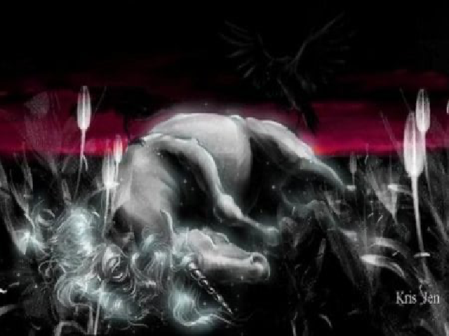
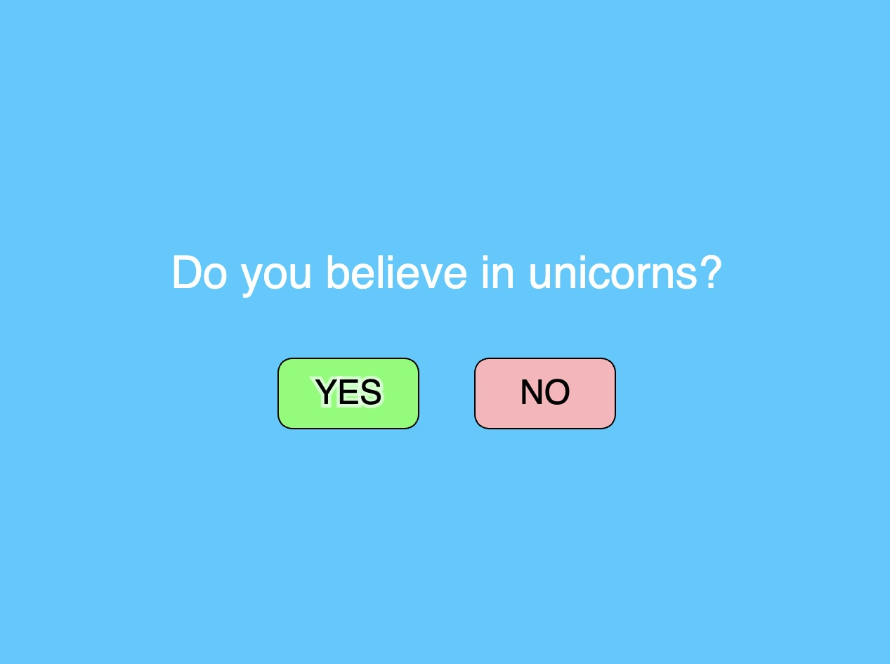
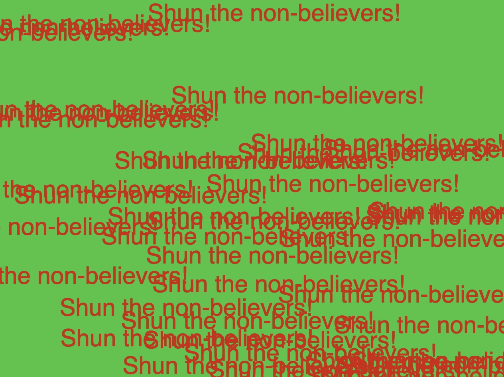
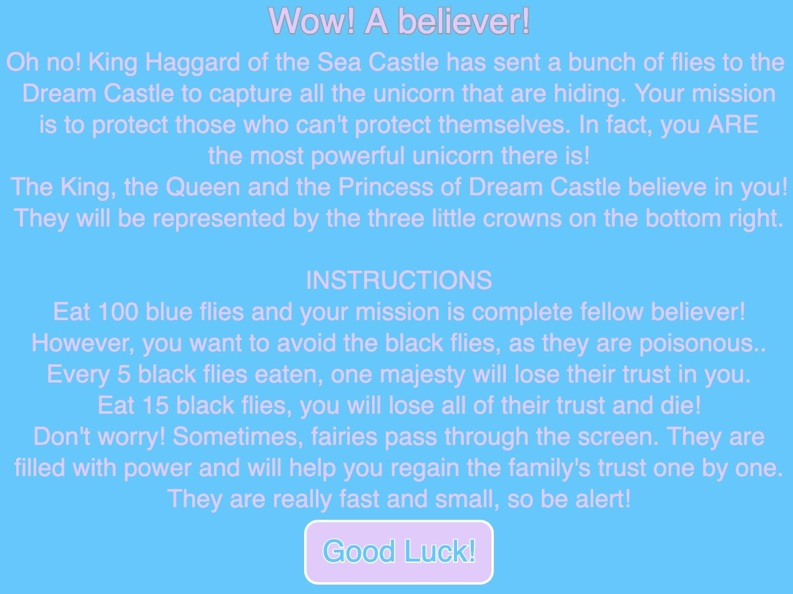
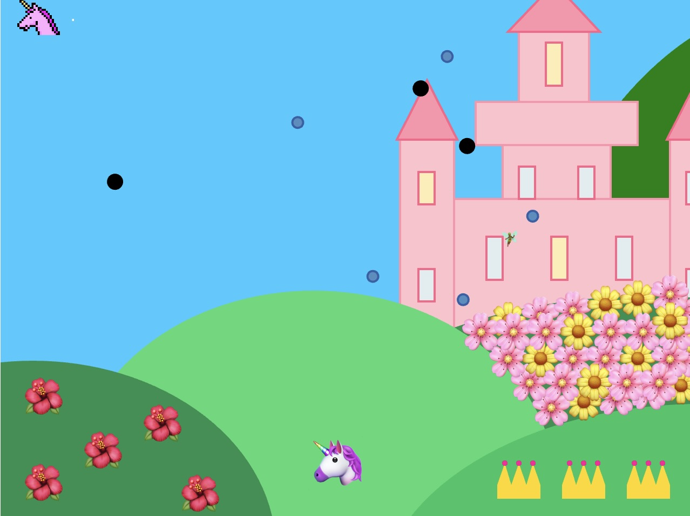
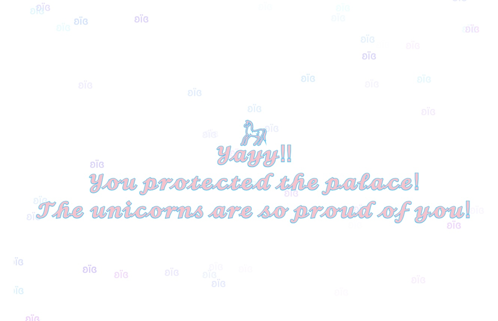
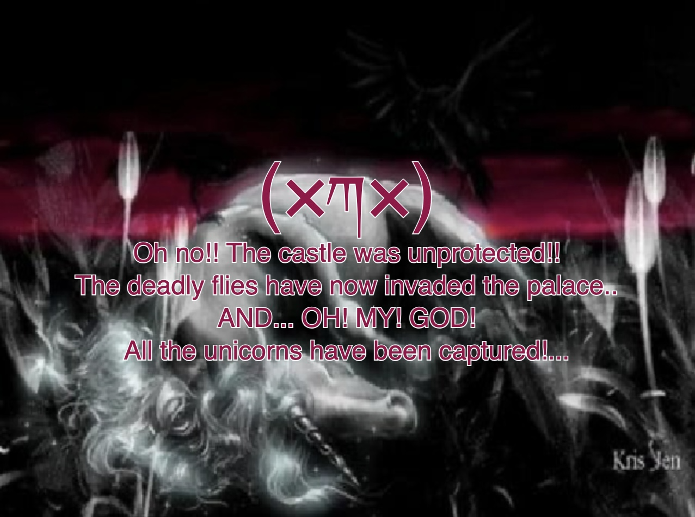

# MOD JAM - Unicorn saves the palace

NERLY CADET

[View this project online](URL_FOR_THE_RUNNING_PROJECT)

## Description

This description should help the reader understand what the program is, anything they should know to be able to experience it (controls, special features, etc.), and what the desired user experience is.

>Before starting the game, the message "Do you believe in unicorns?" appears, with two options: "YES", or "NO"
    >By clicking "YES", the instructions screen appears to let the players know how to play, what to do in order to win, and what to avoid.
    > By clicking "NO", the screen crashes and a the message "Shun the non-believers!" spams itself. The player either doesn't play or has to refresh to try again.

> The plot is slightly inspired by "The Last Unicorn" movie. 
## ALSO SAID IN INSTRUCTIONS SCREEN
    > The villain, King Haggard wants to steal the unicorns that are hidden in the castle. Therefore, he sends a bunch of flies. 
> The goal of the game is to protect the palace from all the flies that infesting the area. There are blue flies, black flies and fairies.
    > The blue flies are bad for the castle, but good to the unicorn. To win the game, 100 blues flies need to be eaten. The score is shown on the grass.
        > When the game is won, a white screen appears, and the player is told they have won the game.
    > The black flies are bad, both for the castle AND the unicorn. Everytime 5 black flies are eaten, a crown is lost.
    > The fairies are good, both for the castle AND the unicorn. However, they're really hard to see, since they're small and fast. Whenever they are eaten, a whole crown is gained. 
    > When all the crowns are lost, the game is lost.
        >When the game is lost, the image of a dead unicorn appears, and the players is told they have lost the game.

## Screenshot(s)

This bit should have some images of the program running so that the reader has a sense of what it looks like. For example:

> 
> 

## What the game looks like
> 
> 
> 
> 
> 
> 

## Attribution

This bit should attribute any code, assets or other elements used taken from other sources. For example:

> - This project uses [p5.js](https://p5js.org).
> - The dead unicorn image is a picture taken from google, https://abstract.desktopnexus.com/wallpaper/1405223/ 
> - The rainbow gif was taken from https://googlefonts.github.io/noto-emoji-animation/?icon.query=rainbow 
> - For the health bar, I was inspired by P5 "Health Bar" Code by Manno. I added some modifications like making the fill a rainbow color. I took the stroke and added a unicorn in the front.
> - For the flowers on the grass, I was bnspired by P5 "Get Started" Tutorial by Layla Quiñones and Jaleesa Trapp. They used actual emojis in text(), instead of drawing flowers. 

## License

This bit should include the license you want to apply to your work. For example:

> This project is licensed under a Creative Commons Attribution ([CC BY 4.0](https://creativecommons.org/licenses/by/4.0/deed.en)) license with the exception of libraries and other components with their own licenses.