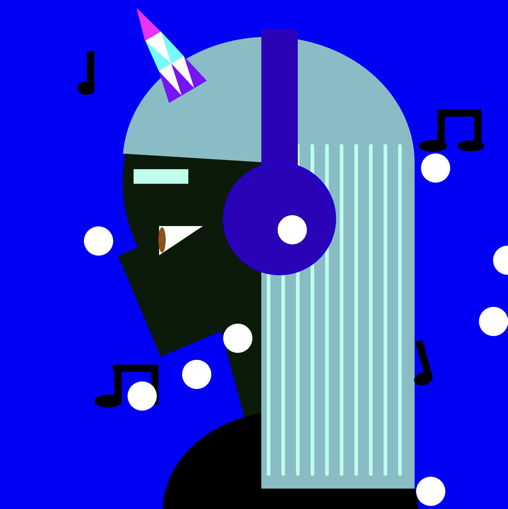

# ART JAM - VOCALOID VERSION OF ME

NERLY CADET

[View this project online](https://nerlylli.github.io/cart253/topics/topics/art-jam/)

## Description

This description should help the reader understand what the program is, anything they should know to be able to experience it (controls, special features, etc.), and what the desired user experience is. For example:

> The project is an abstract portrait of me and the vibe I wish to curate for myself. It is inspired by vocaloid artists' art aesthetic. That is why the character is wearing headphone and is surrounded by music notes. There is also a unicorn, because I believe in unicorns and I believe that being a unicorn is about energy rather than the actual phyiscal. 

> The project is interactive. By moving the white circles around, the unicorn horn project lights that changes colors. The music notes, although lacking user interactions, move around. 

## Screenshot(s)

This bit should have some images of the program running so that the reader has a sense of what it looks like. For example:

> 

## Attribution

This bit should attribute any code, assets or other elements used taken from other sources. For example:

> - This project uses [p5.js](https://p5js.org).
> - The image is a coded drawing of the a vocaloid caricature of myself.

## License

This bit should include the license you want to apply to your work. For example:

> This project is licensed under a Creative Commons Attribution ([CC BY 4.0](https://creativecommons.org/licenses/by/4.0/deed.en)) license with the exception of libraries and other components with their own licenses.